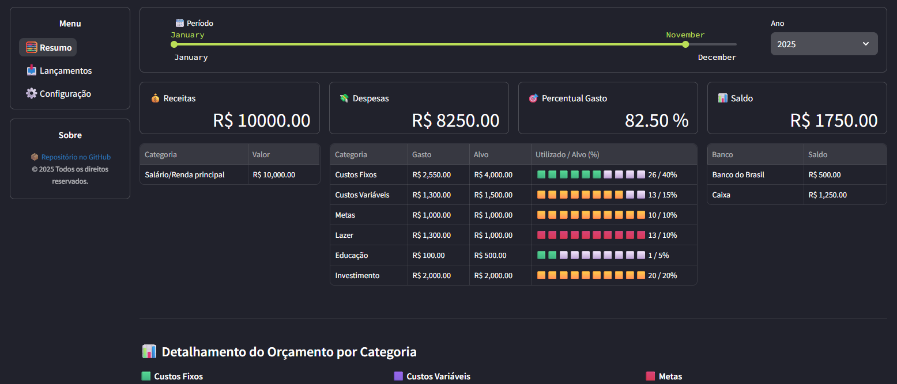
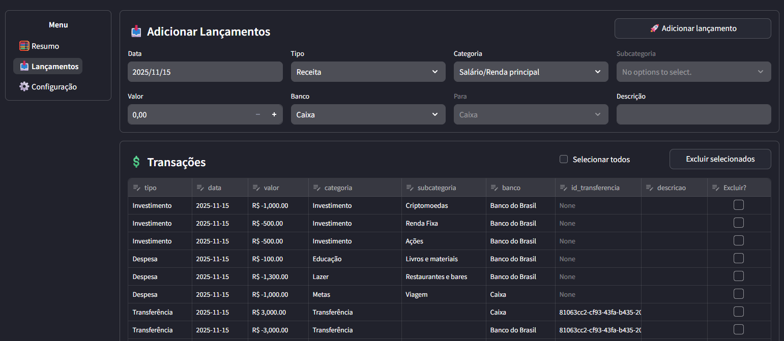
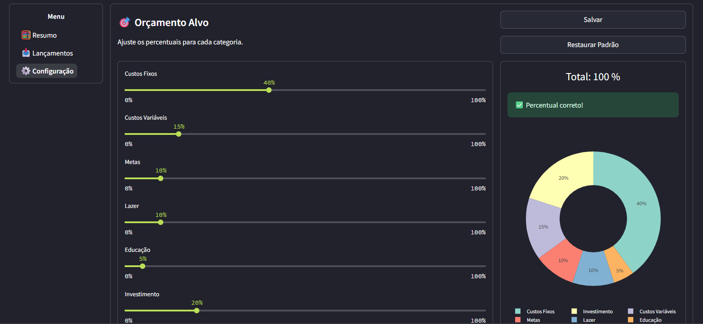

# 🏦 **MyBudget - Gerenciador Financeiro Pessoal com Streamlit**

MyBudget é um aplicativo simples, rápido e intuitivo para **gerenciar
finanças pessoais**, registrar **receitas, despesas, investimentos**,
controlar **contas bancárias**, definir **metas de orçamento** e
visualizar **dados**.\
Construído com **Python + Streamlit + SQLite**, roda localmente.

------------------------------------------------------------------------

## 📌 **Recursos Principais**

### ✔️ Controle Orçamentário

-   Receitas
-   Despesas
-   Investimentos
-   Transferências entre contas
-   Classificação por categoria e subcategoria

### ✔️ Dashboard

-   Resumo financeiro do período
-   Receita total
-   Despesas totais
-   Percentual gasto
-   Saldo
-   Distribuição de gastos por categoria
-   Tabela detalhada por subcategorias
-   Saldo total por banco

### ✔️ Configuração personalizada

-   Ajuste dos percentuais do orçamento
-   Edição de categorias e subcategorias

### ✔️ Banco de dados local (SQLite)

-   Totalmente offline
-   Armazena lançamentos, categorias e metas de orçamento

------------------------------------------------------------------------

## 🗂️ **Estrutura do Projeto**

    MY_BUDGET/
    │
    ├── .streamlit/
    │   └── config.toml
    │
    ├── assets/ 
    │   ├── resumo.png
    │   ├── lancamento.png
    │   └── configuracoes.png
    |
    ├── data/
    │   └── budget.db 
    │
    ├── src/
    │   ├── app.py
    │   ├── db.py
    │   └── pages/
    │       ├── 1_lancamentos.py
    │       └── 2_settings.py
    │
    ├── venv/
    ├── LICENSE
    ├── README.md
    ├── MyBudget.bat
    └── requirements.txt

------------------------------------------------------------------------

## 🚀 **Como rodar o projeto**

### 1️⃣ Clone o repositório

``` bash
git clone https://github.com/SEU_USUARIO/SEU_REPOSITORIO.git
cd SEU_REPOSITORIO
```

### 2️⃣ Crie e ative um ambiente virtual

#### Windows:

``` bash
python -m venv venv
venv\Scripts\activate
```

### 3️⃣ Instale as dependências

``` bash
pip install -r requirements.txt
```

### 4️⃣ Execute o aplicativo

``` bash
streamlit run src/app.py
```

Ou execute o atalho `"MyBudget.bat"`

------------------------------------------------------------------------
## 🧩 Tecnologias Utilizadas

| Tecnologia | Usada para |
|---|---|
| **Python** | Lógica do sistema |
| **Streamlit** | Interface web |
| **SQLite** | Banco de dados local |
| **Pandas** | Manipulação de dados |
| **Plotly** | Gráficos interativos |

------------------------------------------------------------------------
## 📸 Screenshots

### 🧮 Resumo


### 💸 Lançamentos


### ⚙️ Configurações


------------------------------------------------------------------------
## 💾 Banco de Dados

O arquivo `data/budget.db` é criado automaticamente na primeira execução.

| Tabela           | Descrição                                 |
| ---------------- | ----------------------------------------- |
| `transacoes`     | Lançamentos financeiros                   |
| `categorias`     | Categorias e subcategorias personalizadas |
| `alvo_orcamento` | Percentuais do orçamento     |

------------------------------------------------------------------------
## 📌 Roadmap (melhorias futuras)

* Importação de extratos bancários

* Dashboard anual consolidado

* Edição direta de lançamentos

* Controle de cartões de crédito

------------------------------------------------------------------------
## 🤝 Contribuição

Pull Requests são bem-vindos!


------------------------------------------------------------------------
## 📄 Licença

Este projeto está sob a licença **MIT**.
